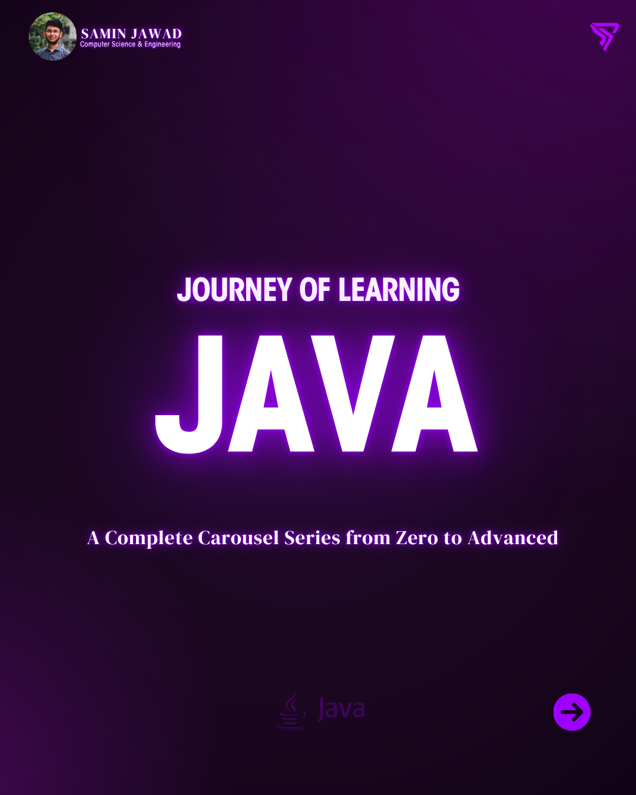

# Journey of Learning Java

> *From zero to advanced. One problem at a time.*

This repository is the **practical companion** to the *Journey of Learning Java* — a direct, concept-first Java carousel series that takes you from zero to advanced, one concept at a time.

The carousels teach the concepts, clearly and in order. This repo proves the practice.

---

## What Is This?

100 Java problems — carefully selected and solved — covering the full spectrum from absolute beginner to advanced Java engineering.

Every solution is written with **clarity over cleverness.**
The goal is not to impress — it's to teach.

---

## Problems

| Problem | Problem | Problem | Problem |
|---------|---------|---------|---------|
| AnagramChecker | CustomClassLoader | InfixToPostfix | PalindromePartitioning |
| AnnotationProcessor | CustomSerializer | JobScheduler | Phonebook |
| ArraySumAverage | DetectCycle | JSONReaderWriter | PrimeChecker |
| BankAccount | DIContainer | KeyValueStore | PrintPattern |
| BasicCalculator | Dijkstra | LargestOfThree | ProducerConsumer |
| BasicHttpClient | DoublyLinkedList | LeapYearDetector | ProfilingOptimization |
| BFSandDFS | EmailValidator | LinearSearch | QueueUsingLinkedList |
| BinarySearch | EmployeeManagement | LinkedList | QuickSort |
| BinarySearchTree | EvaluatePostfix | LowestCommonAncestor | QuizApp |
| BinaryTreeTraversals | EvenOrOdd | LRUCache | RateLimiter |
| BubbleAndSelectionSort | EventBus | LRUTTLCache | ReadWriteLockDemo |
| BytecodeManipulation | Factorial_Iterative | MatrixMultiplication | Rectangle |
| CharFrequency | FastPower | MaxMinArray | RecursiveFactorial |
| ChatServer | FibonacciSequence_Iterative | MemoryLeakDemo | RegexLogParser |
| ConcurrentLRUCache | FileReadPrint | MergeSort | RemoveDuplicates |
| ConcurrentMapPatterns | FileWatcher | MethodOverloading | ReverseString |
| CountVowelsConsonants | ForkJoinExample | MiniQueryEngine | ShardedCounter |
| CountWords | GCD_LCM | MiniWebCrawler | SimpleInterest |
| CSVImporterWithValidation | GraphRepresentation | OAuthSimulation | SimpleORMMapper |
| CSVReader | HelloPlugin | ObjectPool | SimpleReactiveStream |
| CSVToTable | HelloWorld | PalindromeChecker | SimpleRESTAPI |
| CustomClassLoader | InfixToPostfix | PalindromePartitioning | SimpleSearchIndex |
| SimpleThreadPool | StackUsingArrayList | ThreadSafeCounter | URLShortener |
| StaticVsInstance | Stopwatch | ToDoList | WordCountAcrossFiles |
| SumOfTwoNumbers | SwapTwoNumbers | TopKElements | WriteCSV |
| TopologicalSort | TransposeMatrix | TemperatureConverter | |

---

## Who Is This For?

- Beginners who finished the Journey of Learning Java carousel series and want to practice
- CS students preparing for technical interviews
- Self-taught developers building a strong Java foundation
- Anyone who learns best by reading clean, well-explained code

---

## How To Use This Repo

1. Browse the problems list
2. Pick one that interests you
3. Try solving it yourself first
4. Then read the solution
5. Move on only when you truly understand — not just when you've read

> *"Understanding beats memorizing. Every time."*

---

## Carousel Gallery

The 100 problems above are the practice. The carousels below are where the concepts were first taught — 42 lessons, structured from absolute basics to advanced Java. Click any cover to download that carousel's PDF.

  

| | | | | |
|---|---|---|---|---|
|  |  |  |  |  |
|  |  |  |  |  |
|  |  |  |  |  |
|  |  |  |  |  |
|  |  |  |  |  |
|  |  |  |  |  |
|  |  |  |  |  |
|  |  |  |  |  |
|  |  |  |  |  |

---

## Connect & Follow The Series

| Platform | Link |
|----------|------|
| LinkedIn | [linkedin.com/in/samin-jawad](https://www.linkedin.com/in/samin-jawad) |
| Facebook | [facebook.com/SaminJawadOfficial](https://www.facebook.com/SaminJawadOfficial/) |
| Instagram | [instagram.com/samin_jawad_official](https://www.instagram.com/samin_jawad_official) |
| GitHub | [github.com/SaminJawad](https://github.com/SaminJawad) |

---

If this helped you, consider starring the repo — it helps other learners find it.
